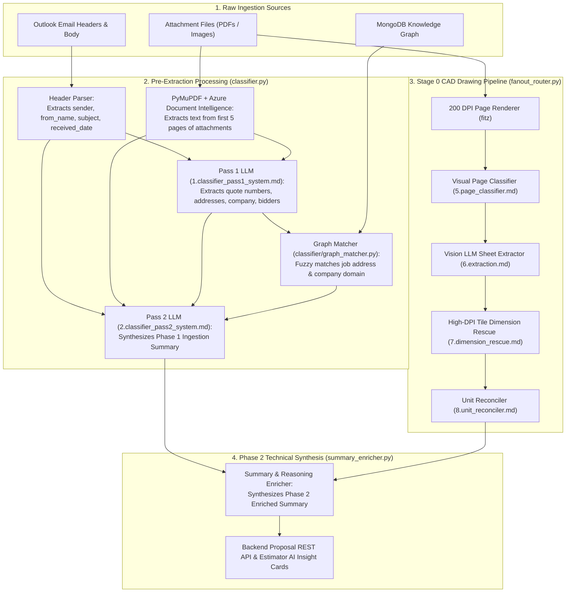

# 3. Data Lineage Map (Where Does the Input Data Come From?)

This diagram details the exact origin and validation path of every data point ingested into the summary and reasoning engine.

```mermaid
flowchart TD
    subgraph Inputs ["1. Raw Ingestion Sources"]
        A1["Outlook Email Headers & Body"]
        A2["Attachment Files (PDFs / Images)"]
        A3["MongoDB Knowledge Graph"]
    end

    subgraph PreExtractionPipeline ["2. Pre-Extraction Processing (classifier.py)"]
        A1 --> B1["Header Parser:\nExtracts sender, from_name, subject, received_date"]
        A2 --> B2["PyMuPDF + Azure Document Intelligence:\nExtracts text from first 5 pages of attachments"]
        B1 & B2 --> C1["Pass 1 LLM (1.classifier_pass1_system.md):\nExtracts quote numbers, addresses, company, bidders"]
        C1 & A3 --> C2["Graph Matcher (classifier/graph_matcher.py):\nFuzzy matches job address & company domain"]
        B1 & B2 & C1 & C2 --> D1["Pass 2 LLM (2.classifier_pass2_system.md):\nSynthesizes Phase 1 Ingestion Summary"]
    end

    subgraph PostExtractionPipeline ["3. Stage 0 CAD Drawing Pipeline (fanout_router.py)"]
        A2 --> E1["200 DPI Page Renderer (fitz)"]
        E1 --> E2["Visual Page Classifier (5.page_classifier.md)"]
        E2 --> E3["Vision LLM Sheet Extractor (6.extraction.md)"]
        E3 --> E4["High-DPI Tile Dimension Rescue (7.dimension_rescue.md)"]
        E4 --> E5["Unit Reconciler (8.unit_reconciler.md)"]
    end

    subgraph FinalEnrichment ["4. Phase 2 Technical Synthesis (summary_enricher.py)"]
        D1 & E5 --> F1["Summary & Reasoning Enricher:\nSynthesizes Phase 2 Enriched Summary"]
        F1 --> G1["Backend Proposal REST API & Estimator AI Insight Cards"]
    end
```
